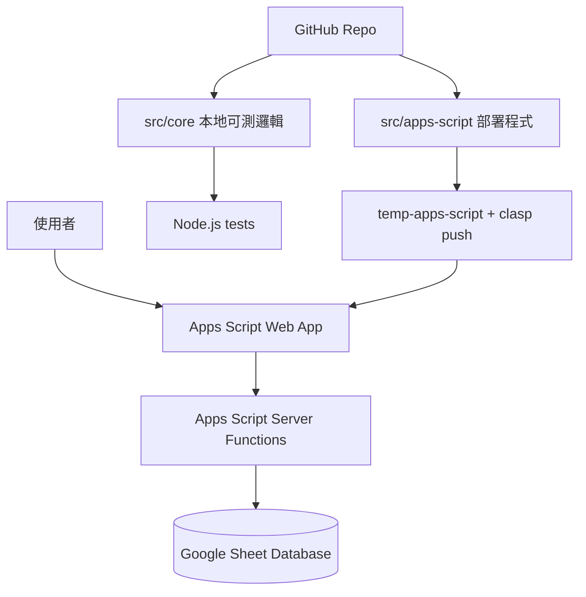

# Accounting Automation 產品開發交接文件

本文件是本專案的主要交接入口。其他工程師或 Agent 接手時，請先讀這份文件，再依需要查看 `docs/handoff-status.md`、`docs/requirements.md`、`docs/data-model.md`、`docs/workflow.md`、`docs/rules.md`、`docs/reports.md` 等歷史補充文件。

> 現行實作以 `src/apps-script/Config.gs`、`src/apps-script/*.gs`、`src/apps-script/*.html`、`src/core/*.mjs` 與 `tests/*.test.mjs` 為準。早期文件若和程式不同，以程式為準。

## 1. 產品目標

這是一套個人記帳與預算控管工具，核心目標是把「預算動支」和「現金流付款」分開處理。

- 預算控管看消費日：花費發生當下就扣年度與月份預算。
- 現金流看付款日：現金支付當天出帳；信用卡依結帳規則產生付款日；分期付款拆成多筆付款排程。
- 資料庫使用 Google Sheet，Web 介面使用 Google Apps Script。
- 程式碼與模板放在 private GitHub repo，真實 Excel 與 Google Sheet 資料不提交。

### 目前已支援

- Google Sheet 資料庫初始化。
- 預算總覽、現金流總覽、每月收入預估、每月帳單預估、近期消費。
- 手動單筆消費新增。
- 手動消費 CSV / 貼上批次匯入，支援有標題列與無標題列。
- 財政部發票 CSV / Excel 複製貼上匯入，並先進入待確認清單。
- 待確認發票分頁載入、批次確認入帳、批次刪除、批次確認並寫入店家支付規則。
- 店家支付方式規則與店家 + 品項預算分類規則。
- 發票重複匯入檢查。
- 發票折扣、點數、零元明細可保留入帳。
- 付款排程明細對帳/修正。
- 收入排程入帳/修正。

### 目前不含

- 期初現金餘額、銀行帳戶餘額、帳戶間轉帳規劃。
- 更完整的信用卡帳單對帳報表與取消消費沖銷流程。
- 自動從 Google Sheet 反向同步產生 GitHub CSV 模板。
- 完整自動學習規則更新 UI；目前已有歷史表與手動寫入店家支付規則的基礎。

## 2. 系統架構



### 主要目錄

| 路徑 | 用途 |
|---|---|
| `src/apps-script/` | 實際部署到 Google Apps Script 的程式與 HTML/CSS。 |
| `src/core/` | 可在本地用 Node.js 測試的純商業邏輯。 |
| `tests/` | 本地測試，覆蓋付款日、預算、現金流、消費、發票匯入。 |
| `rules/` | 匿名規則範例 CSV，部分已更新為現行 schema，仍需補齊所有正式表範例。 |
| `docs/` | 需求、資料模型、流程、報表與本交接文件。 |
| `temp-apps-script/` | 本地 clasp 部署資料夾，通常不提交 Git。 |

### 執行環境

- 前端：Apps Script HTML Service，`Index.html` + `Client.html` + `Styles.html`。
- 後端：Google Apps Script V8，所有 `.gs` 檔案共用全域函式空間。
- 資料庫：Google Sheet。
- 本地測試：Node.js built-in test runner。
- 部署：將 `src/apps-script/` 同步到 `temp-apps-script/`，再用 `clasp push --force`。

## 3. Apps Script 模組責任

| 檔案 | 責任 |
|---|---|
| `Config.gs` | Google Sheet ID、11 張表名稱、表頭、列舉值、初始店家支付規則。 |
| `Sheets.gs` | 初始化工作表、補表頭、讀寫物件、更新列、產生 ID。 |
| `Rules.gs` | 日期、月份、信用卡付款日、分期拆帳、預算狀態、店家支付規則儲存。 |
| `Budget.gs` | 讀取有效預算項目、年度預算使用狀態、單筆消費後預算影響。 |
| `Expenses.gs` | 手動消費新增、付款排程產生、近期消費、手動批次匯入。 |
| `Income.gs` | 收入新增、收入排程清單與修正、現金流總覽、每月帳單預估。 |
| `InvoiceImport.gs` | 發票匯入、待確認清單、批次確認、刪除、重複檢查、歷史寫入、舊資料補值。 |
| `Code.gs` | Web App 入口 `doGet`、前端 include、dashboard payload。 |
| `Index.html` | Web App 畫面骨架。 |
| `Client.html` | 前端互動、呼叫 `google.script.run`、渲染表格與表單。 |
| `Styles.html` | 前端樣式。 |

## 4. Google Sheet 資料庫

資料庫表結構由 `src/apps-script/Config.gs` 的 `HEADERS` 控制。`setupDatabase()` 會建立缺少的表，並對既有表補上缺少欄位；程式讀寫以表頭名稱為準，因此欄位順序不是最重要，但新模板應以 `HEADERS` 順序為準。

### 11 張正式資料表

| 表名 | 用途 | 主要寫入來源 | 主要讀取來源 |
|---|---|---|---|
| `BudgetItems` | 年度與月份預算項目，預算分類唯一合法來源。 | 使用者或預算匯入。 | `Budget.gs`、前端下拉選單、發票/手動確認。 |
| `ExpenseRecords` | 已正式入帳的標準化消費紀錄。 | `createManualExpense()`、`confirmInvoiceDraft()`、手動批次匯入。 | 預算報表、近期消費、重複發票檢查。 |
| `PaymentSchedule` | 現金流付款排程，含信用卡與分期。 | `createPaymentSchedulesForExpense_()`。 | 現金流總覽、每月帳單預估、付款明細對帳。 |
| `IncomeSchedule` | 收入排程或實際收入。 | `createIncome()`、`createMonthlySalarySchedule()`、`updateIncomeStatus()`。 | 現金流總覽、每月收入預估。 |
| `ImportedInvoiceDrafts` | 財政部發票匯入後的待確認草稿。 | `importInvoiceDraftsFromText()`。 | 待確認清單、確認入帳、刪除、重複檢查。 |
| `MerchantPaymentRules` | 店家預設支付方式、信用卡、預設預算項目與人工辨識名稱。 | `setupDatabase()` seed、確認時寫入規則、手動消費寫入規則。 | 發票匯入預設支付方式與預算項目。 |
| `MerchantItemRules` | 店家 + 品項關鍵字對應預算項目。 | 目前主要手動維護。 | 發票匯入預設預算項目。 |
| `ClassificationHistory` | 使用者確認後的分類歷史。 | `confirmInvoiceDraft()`。 | 後續規則學習依據。 |
| `PaymentChoiceHistory` | 使用者確認後的支付方式歷史。 | `confirmInvoiceDraft()`。 | 後續規則學習依據。 |
| `CreditCardRules` | 信用卡結帳日與付款日規則。 | `setupDatabase()` seed。 | 付款日計算。 |
| `AppSettings` | 系統設定，例如現金流期初餘額。 | `setupDatabase()` 建立、`updateCashFlowOpeningBalance()` 更新。 | 現金流期初/期末餘額計算。 |

### 表頭摘要

| 表名 | 欄位 |
|---|---|
| `BudgetItems` | `year`, `category`, `budget_item`, `annual_budget`, `month_01` 到 `month_12`, `is_valid_expense_item`, `notes` |
| `ExpenseRecords` | `expense_id`, `source_type`, `source_record_id`, `consumption_date`, `budget_month`, `merchant_tax_id`, `merchant_name`, `item_description`, `budget_item`, `suggested_budget_item`, `classification_status`, `classification_basis`, `amount`, `payment_tool_type`, `credit_card_name`, `is_installment`, `installment_count`, `expense_status`, `notes` |
| `PaymentSchedule` | `payment_id`, `expense_id`, `payment_sequence`, `payment_date`, `cash_flow_month`, `payment_amount`, `payment_tool_type`, `credit_card_name`, `payment_status`, `notes` |
| `IncomeSchedule` | `income_id`, `income_date`, `income_month`, `income_item`, `income_amount`, `income_status`, `source`, `notes` |
| `ImportedInvoiceDrafts` | `import_id`, `source_type`, `source_record_id`, `source_line_key`, `consumption_date`, `merchant_tax_id`, `merchant_name`, `item_description`, `amount`, `suggested_payment_tool_type`, `suggested_credit_card_name`, `suggested_budget_item`, `classification_status`, `import_status`, `expense_id`, `notes` |
| `MerchantPaymentRules` | `rule_id`, `merchant_tax_id`, `merchant_name_contains`, `merchant_display_name`, `payment_tool_type`, `credit_card_name`, `default_budget_item`, `is_active`, `notes` |
| `MerchantItemRules` | `rule_id`, `merchant_tax_id`, `merchant_name_contains`, `item_keyword_contains`, `budget_item`, `is_active`, `notes` |
| `ClassificationHistory` | `history_id`, `merchant_tax_id`, `merchant_name`, `item_description`, `budget_item`, `confirmed_at`, `notes` |
| `PaymentChoiceHistory` | `history_id`, `merchant_tax_id`, `merchant_name`, `payment_tool_type`, `credit_card_name`, `confirmed_at`, `notes` |
| `CreditCardRules` | `credit_card_name`, `card_group`, `cutoff_day`, `payment_day`, `is_default_for_other_cards`, `notes` |
| `AppSettings` | `setting_key`, `setting_value`, `notes` |

## 5. 使用者流程

### 5.1 初始化

1. Google Sheet 與 Apps Script 專案建立完成。
2. 部署程式後，在 Web App 或 Apps Script 執行 `setupDatabase()`。
3. 系統建立/補齊 11 張資料表。
4. `CreditCardRules` seed 玉山與其他信用卡規則。
5. `MerchantPaymentRules` seed 初始店家支付規則。
6. 使用者將年度預算項目放入 `BudgetItems`。

### 5.2 財政部發票匯入

1. 使用者下載財政部發票 CSV，或從 Excel/CSV 複製明細。
2. Web App 的「財政部發票匯入」可選 CSV 檔或貼上來源值。
3. `importInvoiceDraftsFromText()` 解析原始欄位。
4. 系統產生 `source_line_key`，並檢查 `ImportedInvoiceDrafts` 與 `ExpenseRecords` 是否已存在同一筆發票明細。
5. 非重複資料寫入 `ImportedInvoiceDrafts`，狀態為 `pending`。
6. Web App 顯示待確認清單，預設 50 筆並可載入更多；使用者可批次確認、批次確認並寫入店家支付規則、或刪除不是本人支付的明細。

### 5.3 待確認發票確認入帳

1. 前端會把每筆草稿的預算項目、支付方式、信用卡選項送到 `confirmInvoiceDraftsBatch()`。
2. 後端逐筆呼叫 `confirmInvoiceDraft()`。
3. 每筆確認後建立一筆 `ExpenseRecords`。
4. `createManualExpense()` 會同時產生一或多筆 `PaymentSchedule`。
5. `ImportedInvoiceDrafts.import_status` 更新為 `confirmed`，並回寫 `expense_id`。
6. 同步寫入 `ClassificationHistory` 與 `PaymentChoiceHistory`。
7. 若使用「批次確認並匯入規則」，會新增或更新 `MerchantPaymentRules`，並把店名寫入 `merchant_display_name`。

### 5.4 手動單筆消費

1. 使用者輸入消費日、品項、金額、通路、預算項目、支付方式、信用卡、分期、備註。
2. `createManualExpense()` 驗證必填欄位與金額。
3. 寫入 `ExpenseRecords`，`source_type` 預設 `manual_no_invoice`。
4. 依支付方式與分期產生 `PaymentSchedule`。
5. 回傳該筆消費後的預算剩餘與狀態。
6. 若使用「把本次紀錄匯入店家支付規則中」，會新增或更新 `MerchantPaymentRules`。

### 5.5 手動批次匯入

1. 使用者可上傳 CSV 或貼上整理後的購物車清單。
2. 支援欄位：`消費日`, `購買品項`, `消費金額`, `消費通路`, `預算項目`, `支付方式`, `信用卡`, `備註`。
3. 可貼有標題列資料，也可貼無標題列資料；無標題列時依上述欄位順序解析。
4. 年月格式如 `2026/01` 會正規化成 `2026-01-01`，預算月份為 `2026-01`。
5. `importManualExpensesFromText()` 解析後逐筆呼叫 `createManualExpense()`。
6. `source_type` 使用 `manual_batch_import`。
7. 批次匯入允許 0 或負數金額，用於折扣、點數折抵或購物車調整項。
8. 可選擇同時寫入店家支付規則。

### 5.6 Dashboard

`getDashboardData()` 回傳前端需要的資料：

- `budgetSummary`：各預算項目年度使用狀態。
- `cashFlowOverview`：每月收入、現金支出、信用卡付款、淨現金流。
- `incomeSchedule`：每月收入預估與入帳/修正。
- `paymentSchedule`：付款排程明細。
- `monthlyCreditCardBillEstimates`：每月帳單預估。
- `upcomingCreditCardPayments`：舊版信用卡付款摘要 payload，保留供相容與後續使用。
- `recentExpenses`：近期消費。
- `pendingInvoiceDraftPage`：待確認發票分頁資料。
- `budgetItems`：預算項目下拉選單。
- `enums`：前端列舉值。

## 6. 核心規則

### 6.1 預算與現金流分離

- 預算月份 = `consumption_date` 的月份。
- 預算使用額 = 消費金額，確認消費時立即計入。
- 現金流月份 = `payment_date` 的月份。
- 報表上預算看 `ExpenseRecords`，現金流看 `PaymentSchedule` + `IncomeSchedule`。
- 現金流 UI 拆成收入、現金支出、信用卡付款、月淨流量。

### 6.2 信用卡付款日

| 卡別 | 消費日 | 付款日 |
|---|---|---|
| 玉山 | 每月 1-12 日 | 當月 23 日 |
| 玉山 | 每月 13 日後 | 次月 23 日 |
| 聯邦、國泰、富邦、中信及其他 | 每月 1-5 日 | 當月 17 日 |
| 聯邦、國泰、富邦、中信及其他 | 每月 6 日後 | 次月 17 日 |

現金支付的 `payment_date` 等於 `consumption_date`。

### 6.3 分期付款

- 第一版支援平均分期。
- 前 N-1 期使用 `floor(total / count)`。
- 最後一期 = 總金額 - 前面期數總和。
- 每期付款日從首期付款日開始，每月同日遞延。
- 對帳時可手動修正 `PaymentSchedule.payment_amount` 與 `payment_status`。
- 使用者主要先看「每月帳單預估」彙總；只有金額異常時才展開付款排程明細對帳。

### 6.4 預算狀態

| 使用率 | 狀態 |
|---:|---|
| < 70% | `normal` |
| >= 70% 且 < 90% | `reminder` |
| >= 90% 且 < 100% | `warning` |
| >= 100% | `over_budget` |

### 6.5 發票匯入預設分類順序

發票進入待確認清單時，預設值順序如下：

1. 來源檔案本身的手動註記。
2. `MerchantPaymentRules` 店家支付規則。
3. `MerchantItemRules` 店家 + 品項規則。
4. 都沒有命中時，預設 `24. 餐費` + `cash`。

所有發票草稿仍是 `needs_review`，不會因為有預設值就自動入帳。

### 6.6 發票重複檢查

- 每筆發票明細會產生 `source_line_key`。
- key 基於發票號碼、店家統編、消費日、品項、金額與同筆序號。
- 匯入時會同時檢查：
  - `ImportedInvoiceDrafts.source_line_key`
  - 舊資料的發票基礎欄位組合
  - `ExpenseRecords` 中已確認入帳的發票欄位組合
- 日期會正規化為 `yyyy-MM-dd`，避免 Date 物件或時間戳造成比對失敗。

### 6.7 金額允許規則

- `manual_no_invoice` 手動單筆消費必須大於 0。
- `finance_ministry_invoice` 發票匯入允許 0 與負數。
- `manual_batch_import` 手動批次匯入允許 0 與負數。

## 7. 本地核心測試

`src/core` 放可本地測試的純邏輯，目的是在推送 Apps Script 前先驗證主要規則。Apps Script 端仍需維持相同行為。

| 檔案 | 測試內容 |
|---|---|
| `tests/rules.test.mjs` | 月份、信用卡付款日、分期拆帳、預算狀態。 |
| `tests/budget.test.mjs` | 有效預算項目、預算摘要、單筆消費預算影響。 |
| `tests/cash-flow.test.mjs` | 現金流總覽、每月帳單預估、付款排程、付款狀態更新、月份正規化。 |
| `tests/expenses.test.mjs` | 近期消費、來源欄位、金額允許規則、手動批次解析、無標題列與年月格式。 |
| `tests/income.test.mjs` | 薪資排程、收入清單、收入狀態與金額修正。 |
| `tests/invoice-import.test.mjs` | 發票解析、草稿預設值、批次確認 payload、重複檢查、待確認分頁。 |
| `tests/apps-script-config.test.mjs` | Apps Script 表頭與本地文件化測試。 |

執行完整測試：

```powershell
cd "C:\Users\AA018507\Documents\Codex\記帳軟體\accounting-automation-github"
C:\Users\AA018507\.cache\codex-runtimes\codex-primary-runtime\dependencies\node\bin\node.exe tests\rules.test.mjs
C:\Users\AA018507\.cache\codex-runtimes\codex-primary-runtime\dependencies\node\bin\node.exe tests\budget.test.mjs
C:\Users\AA018507\.cache\codex-runtimes\codex-primary-runtime\dependencies\node\bin\node.exe tests\cash-flow.test.mjs
C:\Users\AA018507\.cache\codex-runtimes\codex-primary-runtime\dependencies\node\bin\node.exe tests\expenses.test.mjs
C:\Users\AA018507\.cache\codex-runtimes\codex-primary-runtime\dependencies\node\bin\node.exe tests\income.test.mjs
C:\Users\AA018507\.cache\codex-runtimes\codex-primary-runtime\dependencies\node\bin\node.exe tests\invoice-import.test.mjs
C:\Users\AA018507\.cache\codex-runtimes\codex-primary-runtime\dependencies\node\bin\node.exe tests\apps-script-config.test.mjs
```

## 8. 開發與維護流程

### 8.1 修改商業邏輯

1. 先在 `src/core` 找對應純邏輯。
2. 先新增或調整 `tests/*.test.mjs`。
3. 確認測試先能捕捉到目標行為。
4. 修改 `src/core` 讓測試通過。
5. 同步修改 `src/apps-script` 對應 `.gs` 檔案。
6. 跑完整測試與 Apps Script 語法檢查。
7. 同步 `src/apps-script` 到 `temp-apps-script`。
8. `clasp push --force` 部署。

### 8.2 Apps Script 語法檢查

可用 Node.js 對 `.gs` 與 `Client.html` 內的 JS 做基本語法檢查。這不是 Apps Script 完整 runtime 測試，但可提早抓括號、字串、語法錯誤。

### 8.3 部署到 Apps Script

```powershell
cd "C:\Users\AA018507\Documents\Codex\記帳軟體\accounting-automation-github\temp-apps-script"
clasp push --force
```

部署後到 Apps Script 網頁重新部署 Web App，或使用既有部署版本測試新程式。

### 8.4 推送 GitHub

```powershell
cd "C:\Users\AA018507\Documents\Codex\記帳軟體\accounting-automation-github"
git status
git push
```

提交前確認沒有真實 Excel、Google Sheet 匯出資料、個人帳務明細被加入 Git。

## 9. 常見維護任務

### 新增資料表欄位

1. 修改 `Config.gs` 的 `HEADERS`。
2. 修改讀寫該欄位的 `.gs` 邏輯。
3. 如有本地核心邏輯，同步修改 `src/core` 與測試。
4. 執行 `setupDatabase()`，它會對既有表補上缺少欄位。
5. 更新本文件與模板。

### 新增信用卡

1. 在 `CreditCardRules` 新增卡別規則，或修改 `seedCreditCardRules_()`。
2. 更新前端信用卡選項與 `ENUMS.creditCards`。
3. 更新 `getPaymentDate_()` / `getPaymentDate()` 若規則不同於既有玉山或其他卡。
4. 補測試。

### 調整發票預設分類

1. 修改 `buildInvoiceDrafts()` 與 `buildInvoiceDrafts_()`。
2. 補 `tests/invoice-import.test.mjs`。
3. 確認待確認清單仍標記 `needs_review`。

### 調整店家規則寫入

1. 修改 `saveMerchantPaymentRuleFromRecord_()`。
2. 確認 `MerchantPaymentRules` 欄位仍包含 `default_budget_item`。
3. 測試「把本次紀錄匯入店家支付規則中」。

## 10. 已知技術債與後續方向

- `rules/` 已部分更新為現行格式，但仍需補齊所有正式表的匯入/範例模板。
- 部分文件仍是需求訪談早期版本，主文件已標示以現行實作為準。
- Apps Script 與 `src/core` 有重複邏輯，修改時必須同步維護。
- Google Sheet 是資料庫，缺少正式 migration 機制；目前靠 `setupDatabase()` 補欄位。
- 規則學習目前有歷史表與手動寫入規則，尚未完整自動化「最近 5 次有 4 次一致才更新預設」。
- 已有付款明細與收入排程的基本對帳/修正 UI；仍缺更完整的信用卡帳單核對報表與取消消費沖銷流程。
- 現金流報表尚未納入期初餘額、帳戶餘額與轉帳規劃。

## 11. 接手檢查清單

新工程師或 Agent 接手時，建議依序確認：

1. `git status` 是否乾淨。
2. `src/apps-script/Config.gs` 的 `SPREADSHEET_ID` 是否指向正確 Google Sheet。
3. Google Sheet 是否有 11 張正式表。
4. `BudgetItems` 是否有有效預算項目，且 `is_valid_expense_item` 為 true。
5. 本地測試是否通過。
6. `temp-apps-script` 是否已和 `src/apps-script` 同步。
7. Apps Script 是否已重新部署 Web App。
8. 測試 Web App：Refresh、發票匯入、待確認批次確認、手動單筆、手動批次匯入。

## Supabase and Vercel Migration Direction

The next product direction is a dual-track transition:

- Keep the Google Apps Script and Google Sheet MVP running.
- Build Supabase as the next data foundation.
- Build the Vercel frontend around clearer product areas: Home, Expense Entry, Review Queue, Bill Center, Cash Flow, Budget, Rules, and Settings.
- Import and reconcile data before switching daily usage away from Google Sheets.

Payment schedules remain a low-level source for monthly bill estimates. The user-facing credit-card area is Bill Center, where estimated bills can later be compared with real credit card statements.

Budget Taxonomy v2 introduces `Budget Group / Budget Item` while keeping legacy budget names traceable. Old-to-new budget mapping must remain review-gated and must not silently rewrite official expense classifications.

Decision: the first Supabase version stores `credit_card_bill_estimates` as a physical table regenerated by the app or import process. Keep the schema compatible with a future view or materialized-view implementation if recalculation cost, consistency needs, or product behavior make that preferable later.

Frontend IA Shell v1 lives under `apps/web`. It is a Vercel-ready Next.js app that uses typed mock data first. Its first purpose is to validate product structure: Home, Expense Entry, Review Queue, Bill Center, Cash Flow, Budget, Rules, and Settings. It does not replace the Apps Script Web App until Supabase data wiring and migration verification are complete.

Current handoff status is tracked in `docs/handoff-status.md`. As of 2026-06-09, Supabase authentication, dashboard reads, Google Sheet transaction import, expense detail display, and the first Vercel expense-entry write flows are implemented. The Vercel app can create manual expenses, monthly fixed expenses, manual batch imports, and invoice draft imports. It does not yet have full feature parity with Apps Script: Supabase invoice-draft confirmation, real credit-card statement entry/import, full cash-flow recomputation, and merchant rule management still need follow-up work.

### Schema Reconciliation Matrix

The current Google Sheet workbook is the deployed Apps Script runtime schema. It has 11 sheets and should be treated as the current production model.

The Supabase schema is the next-generation migration target. It includes tables and concepts that do not exist in the current Google Sheet workbook yet.

| Product area | Current Google Sheet model | Next Supabase model | Status |
|---|---|---|---|
| Runtime source of truth | 11 Google Sheet tabs managed by Apps Script `HEADERS` | Supabase Postgres tables | Google Sheet remains active during dual-track transition. |
| System settings and opening balance | `AppSettings` stores settings such as `cash_flow_opening_balance` | `cash_flow_months.opening_balance` plus future settings/config tables as needed | Current foundation exists; Supabase will model generated monthly balances separately. |
| Expense records | `ExpenseRecords` | `expenses` | Same accounting concept; Supabase adds `household_id`, `user_id`, stronger foreign keys, and source traceability. |
| Payment schedule details | `PaymentSchedule` | `payment_schedules` | Same low-level source for cash-flow timing and bill estimates. |
| Monthly bill estimate | Derived from `PaymentSchedule`; not stored as its own Google Sheet tab | `credit_card_bill_estimates` | New Supabase table for Bill Center and monthly card summaries. |
| Real credit card statement | Not available as a formal Google Sheet tab | `credit_card_statements` | New Supabase table; cash flow should prefer actual statement amount when present. |
| Cash-flow monthly totals | Calculated from `IncomeSchedule`, `PaymentSchedule`, and `AppSettings` | `cash_flow_months` | New Supabase generated/summary table. |
| Income | `IncomeSchedule` | `income_schedules` | Same concept; Supabase adds household/user ownership and traceability. |
| Fixed recurring expenses | Generated through current expense/payment write path; no dedicated Google Sheet schedule tab | `expense_schedules` | New Supabase table for schedule definitions. |
| Budget taxonomy | Flat `BudgetItems` using legacy names such as `24. 餐費` | `budget_groups` + `budget_items` | New two-level taxonomy; legacy code/name retained for audit. |
| Budget migration mapping | Not available | `budget_mapping_drafts` | New review-gated migration workflow. |
| Invoice import drafts | `ImportedInvoiceDrafts` | `invoice_import_batches` + `invoice_drafts` | Supabase separates import batch metadata from draft rows. |
| Manual batch import drafts | Manual batch import currently writes through expense flow; no dedicated draft table | `manual_import_batches` plus future draft handling | New migration/UX foundation. |
| Merchant payment rules | `MerchantPaymentRules` | `merchant_payment_rules` | Same concept; Supabase uses foreign keys to cards and budget items. |
| Merchant item rules | `MerchantItemRules` | `merchant_item_rules` | Same concept; Supabase uses foreign keys to budget items. |
| Classification history | `ClassificationHistory` | Future history/audit tables or event log | Current history exists; exact Supabase audit structure remains a later decision. |
| Payment choice history | `PaymentChoiceHistory` | Future history/audit tables or event log | Current history exists; exact Supabase audit structure remains a later decision. |
| Credit card rules | `CreditCardRules` | `credit_cards` | Supabase treats cards as household-owned master data with cutoff/payment rules. |
| Migration tracking | Not available | `migration_runs` + `migration_issues` | New Supabase migration reconciliation layer. |
| Household sharing | Not available | `households` + `household_members` | Reserved for future sharing; first release remains private/single-user. |
